## 分支合并  

> 为什么要使用 rebase ?  

开发过程中难以避免的会产生一些无意义的提交记录。但为了保持项目 commit 记录的整洁，  
以便后续代码维护与审核，所以我们需要对这些 commit 记录进行整理和加以维护。  

> 怎么使用 rebase ?

假设我们的 develop 分支上已经有了两次提交，初始化仓库的 Init 节点和创建了 Sales 模块的节点。  
[初始的develop分支](./images/初始的develop分支.png)  
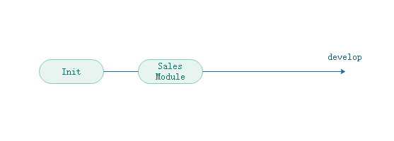  

然后我基于 Sales Module 签出了一个新分支 dev/ben 来进行新功能 CRM 模块的开发  
开发过程中, 我每天都提交了相关的 commit 记录, 这里假定只有三条  
[签出 dev/ben 分支](./images/签出dev_ben分支.png)  
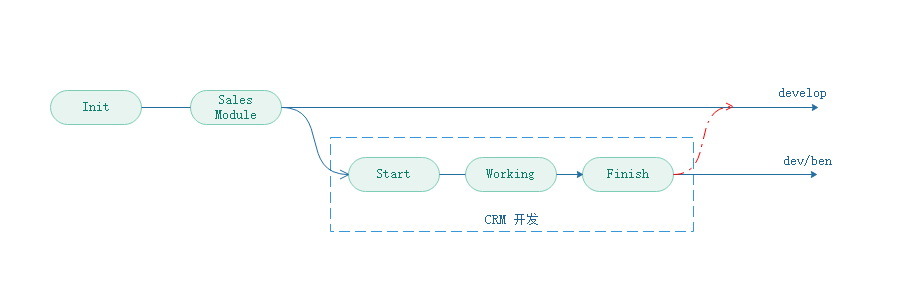  

当我完成 CRM 模块的相关开发后, 我需要向 origin/develop 分支发起合并请求  
发起请求之前, 我们需要进行额外但重要的两步: 合并本地 commit 记录, 更新本地分支  

#### 合并 commit 记录  

在合并前的commit记录中可以看到, 我工作的一些细节或流程被记录下来, 
而这些东西我们却不希望将其合并到远程仓库的分之中去  
因此我们需要使用 ```git rebase -i``` 来合并commit记录  
[合并前的commit记录](./images/CRM合并前的commit记录.png)  
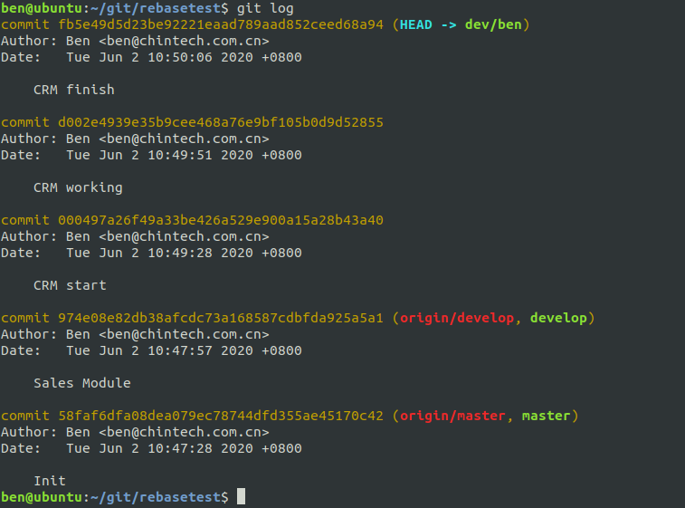  
```
# 使用git rebase -i 返回到你所有修改的前一次父提交上, 即当前分支的基上
# -i 进入交互模式
# 可以使用 commit id 也可以使用分支名 
git rebase -i 974e08
```
[rebase的交互模式](./images/rebase交互模式.png)  
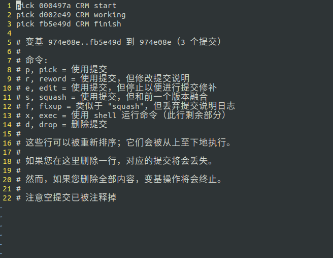  

[rebase交互记录](./images/rebase交互修改记录.png)  
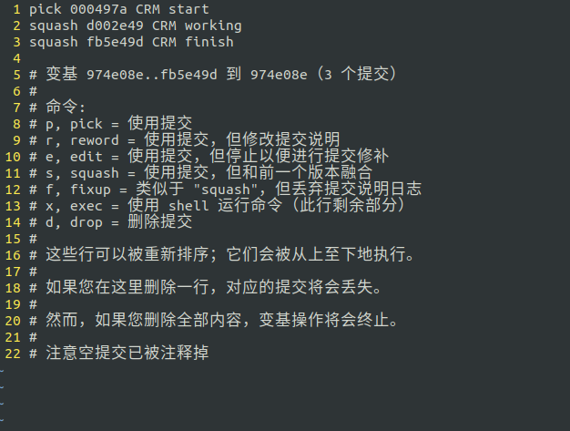  
在交互模式中, Git 给出详细的参数解释  
我们只需要将第二行和第三行的pick修改为 'squash' 或 's', 使它们与其父提交合并    
保存退出后 git 会要求你修改合并后的 commit message, 这里将原本的三条 commit 记录修改为一条 'CRM Module'    
[修改合并的commit message](./images/修改合并的commit message.png)  
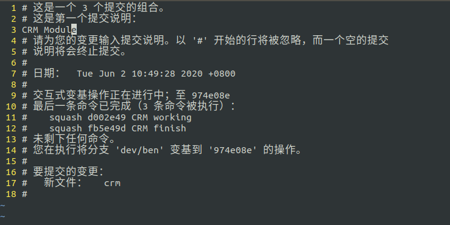  
最后是修改后的commit记录, 此时我们就已经得到了一个干净的提交记录  
[修改后的commit记录](./images/CRM合并后的commit记录.png)  
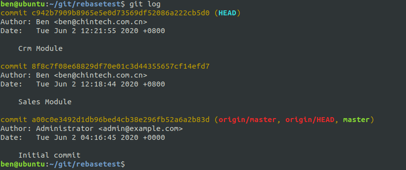  

#### 更新本地分支  
我们分支合并的目的是将当前开发的新功能合并到远程的开发分支中 origin/develop  
因此我们可以执行:

```git pull --rebase origin develop```  
这行代码从远程分支 origin/develop 中拉取更新, 然后当前分支变基到 origin/develop   
同时可以将该行命令拆解为:  
```
git fetch origin develop
git rebase origin/develop
```

```
git fetch origin develop
# 拉取远程仓库develop分支的更新到本地, 但不进行合并
# 区别于 git pull 会自动尝试合并

```  

[更新本地分支前](./images/更新本地分支前.png)  
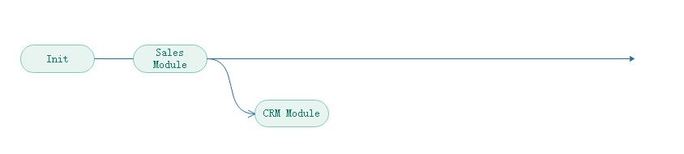  

[更新本地分支后](./images/更新本地分支后.png)  
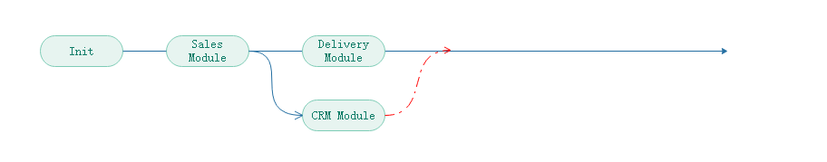  

为了形成线性的commit记录, 我们应该将现在的开发分支变基到远程分支的最新的commit记录之后  
```
# 注: 此处未使用交互模式  
git rebase origin/develop
```  

在本例中, 远程分支中已经更新了 delivery 模块, 所以使用该命令后, 
会将dev/ben的基变到origin/develop现在所在的Delivery Module节点上

变基后未产生冲突的话, 则能查看到线性的提交历史, 此时方可提交和并请求  
[变基后](./images/变基后.png)   
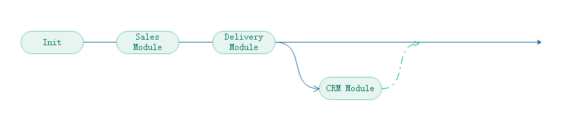  


此时如果双方修改了同一文件, 那么变基则会难以避免的产生冲突   
对于冲突, 只有在协商明确之后,才能修改远程仓库中对方的代码  
除此之外我们以远程分支上的代码为准, 禁止变动远程仓库代码  
[base节点冲突](./images/base节点冲突.png)  
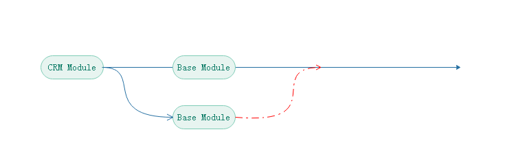  

在这个冲突的例子中, 我在 dev/ben 分支中修改了 base 文件, 而远程仓库中也有人编辑了此文件  
此时 rebase 到远程分支的最新节点时, 产生冲突  
[rebase冲突提示](./images/rebase冲突.png)  
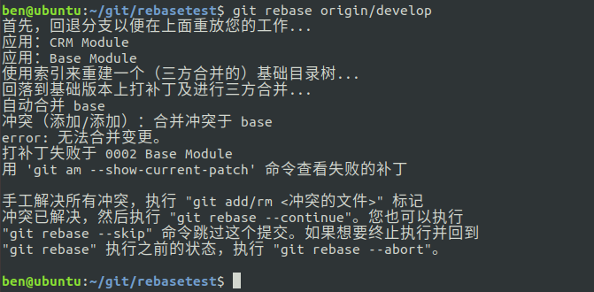  

根据提示修改对应文件  
Git 在文件中自动生成了辅助修改冲突的注释  
* 冲突文件内容

```
<<<<<<< HEAD
# 远程分支修改的代码, 禁止改动
# 应与代码原作者进行沟通, 确保不会覆盖他人的代码
=======
# 这次合并中你修改的代码
>>>>>>> Commit message
```

> 提交与请求合并 

完成上述两步之后, 我应该将自己的本地分支 dev/ben 提交到远程的 dev/ben 分支,  
并提交一个合并请求, 这样审核者就能直接合并远程仓库中的 dev/ben 和 develop 分支    
由于merge之前我们已经进行过了 commit 合并与变基.  
所以在merge时, 我们得以最大程度的保证了不会产生冲突, 并得到了一个整洁的提交记录  
[Merge后的提交记录](./images/Merge后的提交记录.png)  
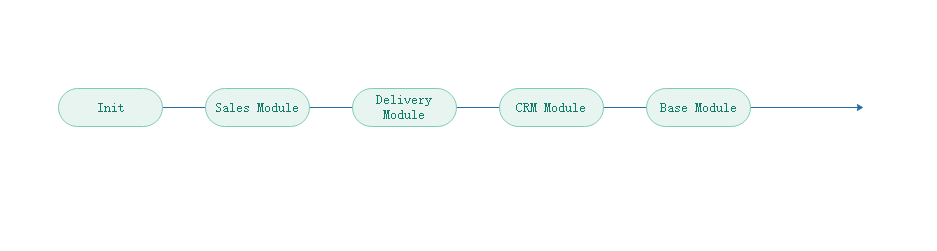  

提交到本地的 dev/ben 分支到远程仓库的 dev/ben 时, 大概率会因为变基的原因而导致推送出错  

不要慌张, 这是因为由于变基导致你的本地分支比远程分支多出一条或多条历史记录, 
这些记录来自其他人提交到远程 develop 分支产生的记录, 当你变基到远程 develop 的新记录上时, 
这些记录就会对你的仓库产生影响  
但是在保证解决了变基导致的各种冲突之后, 你完全可以放心的使用 ```git push origin dev/ben -f```  
来进行强制推送, 因为没有人会在你的分支上进行开发. 就算出错了, 你的本地仓库中也保留你的代码.  

这么做的带来的部分问题是:
1. 远程仓库不会保存你的commit记录, 一旦本地仓库丢失, 那么你将丢失你的大部分commit记录   